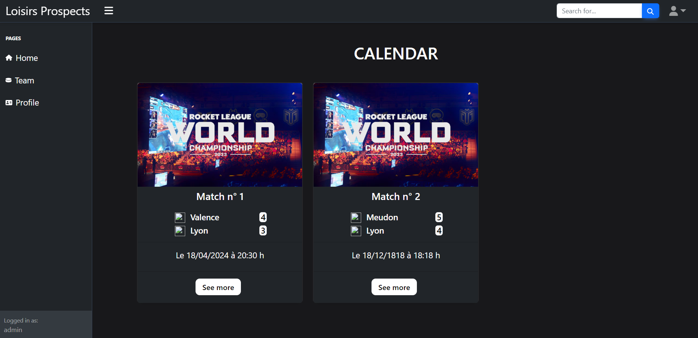
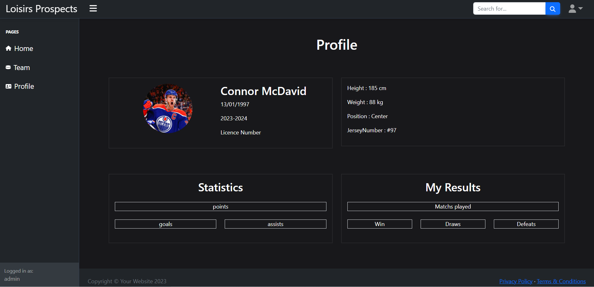
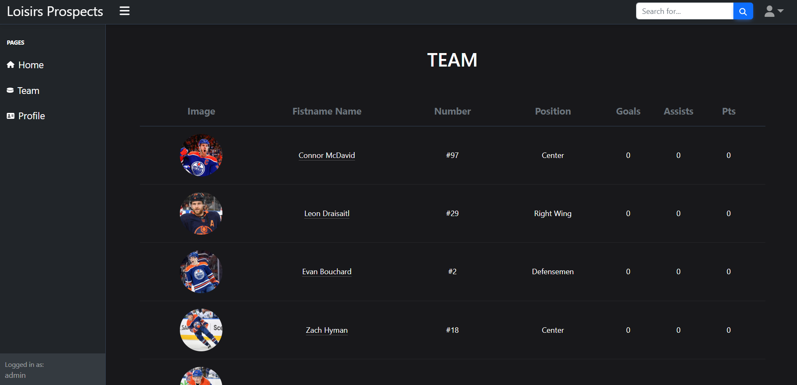

# Bienvenue sur Loisirs Prospects

## Contexte : Application qui gère une saison sportive pour une équipe
Les users pourrait voir les matchs passés et à venir, tous les joueurs de l'équipe et une page profil contenant leurs statistiques collectives et individuelles.
Pour débuter sur PHP je pense que ce projet était un peu trop élevé pour mon niveau mais je pense avoir rendu un résultat à la hauteur de mes compétences après 5 semaines de PHP.

## Etape 1 : J'aime le front 
Pour entamer mon projet **PHP** je commence avec ... **du front.**
Cela me permet de m'imaginer la structure de mon site et de me projeter plus facilement.
Je commence aussi par me créer un schéma de base de données qui ne sera finalement pas très utile car 3 tables suffiront pour là où j'ai stoppé mon projet.

Une fois mes pages crée j'ai décidé de m'exercer a PDO avec un bdd fictive en php afin d'afficher tous les users ainsi que leurs informations personnelles.

## Etape 2 : A la conquête de PHP 
Après m'être amusé avec bootstrap il était temps de commencer PHP en relation avec PhpMyAdmin et de créer mes pages register et login.
### Page Register / Login
Une fois les deux pages fonctionnelles j'ai dû réfléchir à sécuriser les formulaires.
Pour la page register et login c'est avant tout de vérifier si les champs sont bien "isset" et pas "empty".
Ensuite je vérifie si l'adresse mail est valide et si ce n'est pas un doublon dans la page register.

## Etape 3 : Construction du site 
Arriver à ce stade j'avais déjà passer beacoup de temps sur le projet à tenter de faire marcher mon code et je voyais que mettre en place toutes le fonctionnalités allait être long et difficle.

### Page d'accueil / Calendrier
Une page visible par tous afin de voir les match à venir ainsi que les matchs passés.
L'admin aura la possibilité de créer un match à venir et de modifié un match passé pour y ajouter le score.
L'étape de modification aura été très longue : 
* J'ai d'abord dû utiliser un "update" pour modifier un match
* De savoir quel match je modifiais : Pour ça j'ai rentré l'id du match dans un "$_GET" dans le value d'un bouton.

 ### Page profil
 Dans le même idée que les matchs j'ai dû ajouter un update pour que les users puissent ajouter des infos personnelles dans leur page profil.

 

### Page Equipe
 Une page contenant la liste de tous les joueurs.
 Chaque membre est cliquable et directement lié a la page profil du joueur.

 

## Etape 4 : **Le problème**
A ce moment-là mon code marchait mais c'était un gros chantier. Illisible.
J'ai donc voulu terminer mon projet en faisans mes différentes fonctionnalités mais avec un code très difficile à comprendre j'ai eu énormément de mal.

1. **Gestion des erreurs :** Gestion fonctionnelle avec le $_SESSION mais pas très réutilisables. Le mieux aurait été de créer une classe afin de pouvoir donner un nom à mon erreur pour la réutiliser.
2. **Fonction 'checkFields'** permettant de vérifier sur tous les champs saisis sont issett et pas empty.
3. **Fonction 'verifierSession'** qui permet de vérifier si la session est active et de l'activer dans le cas contraire.

J'ai voulu continuer la factorisation sous formes de classes mais fautes de temps et surtout de compétences en POO je n'ai pu créer qu'une seul classe permettant de vérifier si l'email est un doublon... et je me suis aidé de l'IA pour me corriger.

## Perspectives d'évolutions
**LA FACTORISATION** est vraiment là où j'ai pas assez investi de temps.
Cela m'a perdu dans mon code. Donc si je devais refaire le site je factoriserais petit à petit et non tout à la fin.

* Mettre en place la partie statistiques des joueurs 
* Elargir le site à un championnat et non pas à une seule équipe
